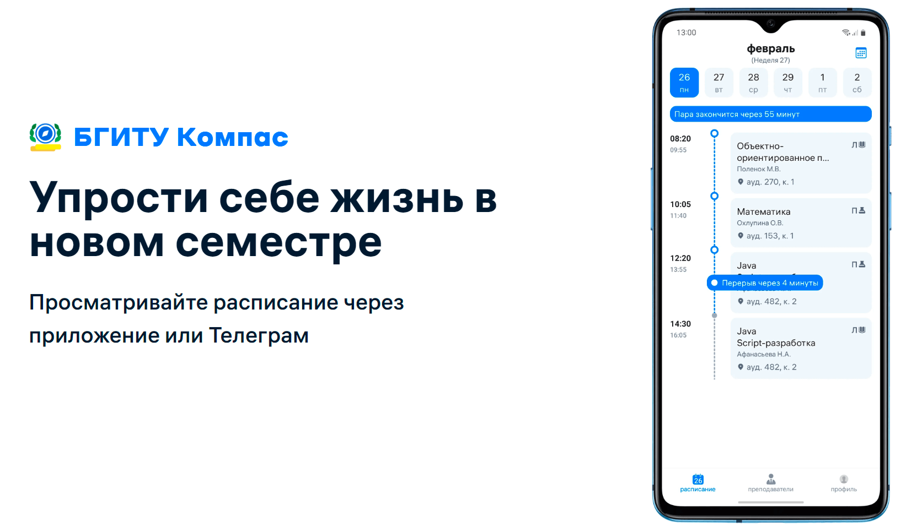
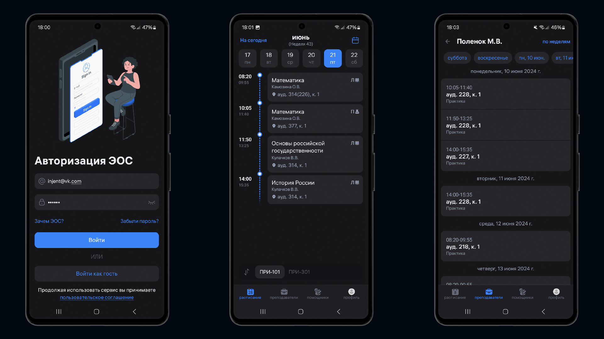

BGITU Compass
==================

**BGITU Compass** a specialized Android application for the students of Bryansk State University of Engineering and Technology.

The app is currently in development. The stable version can be downloaded from [our site](https://bgitu-compass.ru)

# Features

**BGITU Compass** allows you to view the current schedule of all bachelor's and master's degree groups, view the teacher's schedule, looking for study helpers.

# Screenshots

